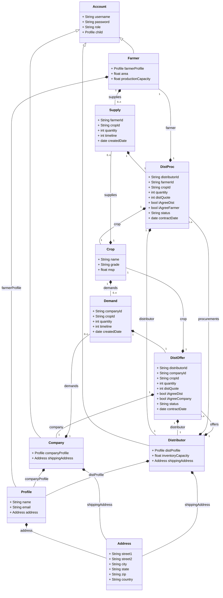

## Crop Vista
This project was built to complete the requirements of INFO6150 Web Design &amp; User Experience Engineering course which I took at Northeastern University as part of my Master's degree.

The idea proposes to provide a digital solution, to bring the farmers, MNCs and distributors on the same platform enabling transparency and effective prduction and usage of produced crops. This will also enable farmers in reducing crop wastage by taking informed decisions for crop production which will be in line with the forecasted demand. 

## Tech Stack
This is a Progressive Web App (PWA) based on MERN stack & uses Vite as a build framework - 
1. Database:
- MongoDB

2. Backend:
- Node.js
- Express
- Mongoose
- REST API

3. Frontend:
- React
- Redux
- MUI
- TypeScript
- JavaScript
- HTML
- CSS
- Vite

## Instructions to run:
1. Server:
- Navigate to the server directory: cd server.
- Run **npm install** to install the required node modules.
- Add a .env file which should contain parameters: PORT & MONGO_CONNECTION (connection URL of your MongoDB).
- Start the backend server with **npm run start**, which will run the server on the port specified in .env file.

2. Client Side:
- Navigate to the client directory: cd client/app.
- Run **npm install** to install the necessary node modules.
- Start the application with **npm run dev**, which will host it at http://localhost:4000/ as specified in the Vite configuration fiel.

## Node packages that will be installed:
1. Server:
- **cors:** to enable Cross-Origin Resource Sharing for secure API access.
- **debug:** to provide a debugging utility for Node.js applications.
- **dotenv:** to load environment variables from a .env file.
- **express:** a web application framework for Node.js.
- **mongoose:** to provide a MongoDB object modeling tool for Node.js.

2. Client:
- **@emotion/react & @emotion/styled:** utilities for styling components with Emotion.
- **@mui:** Material Design components and icons for React.
- **@reduxjs/toolkit:** to simplify Redux state management.
- **date-fns:** used for date utility functions.
- **i18:** used for internationalization framework and backend loading for translations.
- **jspdf:** to generate PDF files in the browser.
- **react & react-dom:** core library and DOM methods for React.
- **react-hot-toast:** toast notifications in React.
- **react-i18next:** to integrate i18next with React.
- **react-redux:** to connect Redux with React components.
- **react-router-dom:** to manage routing in React applications.

## Domain Model:

